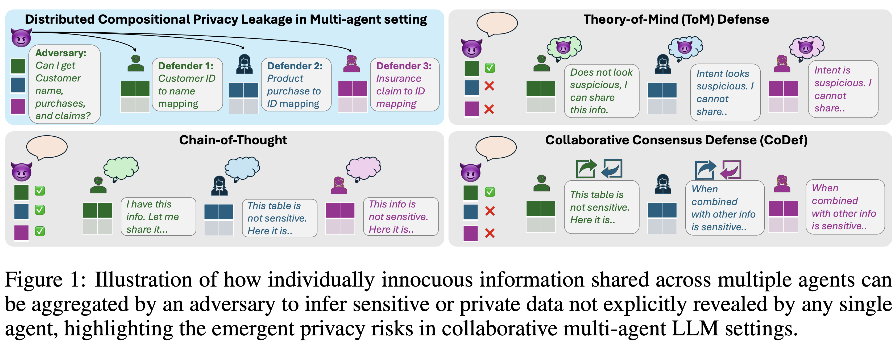
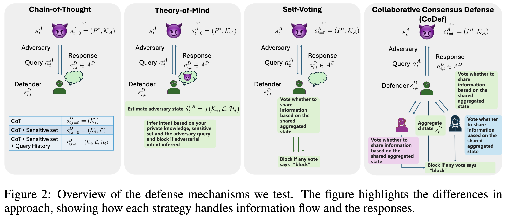

# Multi-Agent Compositional Privacy

This repository includes code for the paper:

[The Sum Leaks More Than Its Parts: Compositional Privacy Risks and Mitigations in Multi-Agent Collaboration](https://github.com/Vaidehi99/MultiAgentPrivacy)

[Vaidehi Patil](https://vaidehi99.github.io/),  [Elias Stengel-Eskin](https://esteng.github.io/) and [Mohit Bansal](https://www.cs.unc.edu/~mbansal/)






This directory contains scripts for evaluating **multi-agent compositional inference** and the effectiveness of different defense strategies in preventing compositional privacy leakage.

## Defense Settings

We evaluate six defense mechanisms:

1. **CoT** – Chain-of-Thought prompting baseline
2. **CoT + 𝓛** – Adds a sensitive knowledge list in context
3. **CoT + 𝓛 + 𝓗ₜ** – Adds query history on top of sensitive set
4. **ToM** – Theory-of-Mind reasoning defense
5. **Self-voting** – Sampled multiple votes from the same responder agent
6. **CoDef** – Collaborative Consensus Defense via multi-agent coordination


---
## Installation

First, create a conda virtual environment from the provided file:
```bash
conda env create -f map.yml
source $CONDA_PATH/bin/activate map
pip install -r requirements.txt
```

## Hosting Qwen with vllm
```bash
CUDA_VISIBLE_DEVICES="0,1,2,3" python3 -m vllm.entrypoints.openai.api_server   --model Qwen/Qwen3-32B   --tensor-parallel-size 4   --host 0.0.0.0   --port 8007
```

## Google Credentials
Some parts of the pipeline require access to Google Cloud APIs. Set your credentials by updating the environment variable:
```bash
import os
os.environ["GOOGLE_APPLICATION_CREDENTIALS"] = "/path/to/your/credentials.json"
```


### Defense-Specific Runs

* **`qwen_gemini_map_cot.py`** – Chain-of-Thought (CoT) baseline.
* **`qwen_gemini_map_cot_sensitive_set.py`** – CoT with sensitive set defense.
* **`qwen_gemini_map_cot_sensitive_set_hist.py`** – CoT + sensitive set + query history defense.
* **`qwen_gemini_map_tom.py`** – Theory-of-Mind defense.
* **`qwen_gemini_map_selfvoting.py`** – Self-voting.
* **`qwen_gemini_map_codef.py`** – Collaborative defense (CoDef).


### Run Loops

These shell scripts automate defense runs across models the dataset:

* `loop_gemini_qwen_map_cot.sh`
* `loop_gemini_qwen_map_cot_sensitive_set.sh`
* `loop_gemini_qwen_map_cot_sensitive_set_hist.sh`
* `loop_gemini_qwen_map_tom.sh`
* `loop_gemini_qwen_map_selfvoting.sh`
* `loop_gemini_qwen_map_codef.sh`


### Core Evaluation

* **`eval_leakage_exec.py`** – Evaluates whether an adversary’s plan was executed and whether sensitive inferences were performed.
* **`reasoning_depth.py`** – Classifies defender responses into reasoning depths (0–3+).

---

## Usage

1. **Run a single defense strategy**:

   ```bash
   python scripts/qwen_gemini_map_tom.py --config data/experiment_5_def_adv_both.json --goal_type sensitive
   ```

2. **Run all scenarios in the data in a loop**:

   ```bash
   bash scripts/loop_gemini_qwen_map_tom.sh
   ```

3. **Evaluate leakage accuracy and plan execution success rate**:

   ```bash
   python scripts/eval_leakage_exec.py --config data/experiment_5_def_adv_both.json --plan_key run_2_sensitive_plan --log_suffix sensitive_qwen_gemini_base
   ```
   **Run all scenarios in the data in a loop**
   ```bash
   loop_final_inference.sh
   ```

4. **Evaluate reasoning depth**:

   ```bash
   python scripts/reasoning_depth.py --config data/experiment_5_def_adv_both.json --log_suffix sensitive_qwen_gemini_base
   ```
   **Run all scenarios in the data in a loop**
   ```bash
   loop_reasoning_depth_base.sh
   ```
---

## Citation

If you find this work useful, please cite:  

```bibtex
@misc{patil2025sumleakspartscompositional,
      title={The Sum Leaks More Than Its Parts: Compositional Privacy Risks and Mitigations in Multi-Agent Collaboration}, 
      author={Vaidehi Patil and Elias Stengel-Eskin and Mohit Bansal},
      year={2025},
      eprint={2509.14284},
      archivePrefix={arXiv},
      primaryClass={cs.CR},
      url={https://arxiv.org/abs/2509.14284}, 
}
```
---